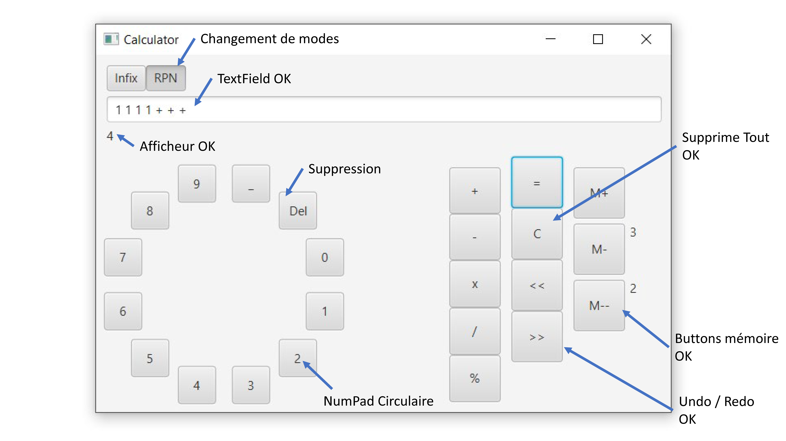
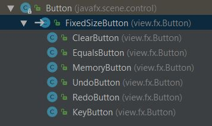

<table>
    <tr>
        <td>CALVEZ Tony </br></td>
		<td>FIPA20 </br>17/10/2018</td>
</table>


## COMPTE-RENDU : FXCalculator

### Introduction

Suite aux cours de Génie Logiciel, nous devions réaliser une calculatrice Infix / RPN

### 1. Ce qui fonctionne : 



J'ai réalisé la calculatrice avec l'ensemble des demandes du cahier des charges : 

- le changement de mode

- le textfield

- l'afficheur

- le numpad en circulaire

- les opérateurs

- les buttons supplémentaires : undo / redo + mémoire

------------------------

### 2. Ce qui ne fonctionne pas : 

Pour pouvoir interargir avec les classes, j'ai mis en static le textfield, le label et le radiobutton.

Comme ceci : 

```java
public static ToggleButton infixButton;
```


Il est possible aussi de faire de l'infix avec le RPN mais ceci est retrouvable dans l'ensemble des codes de la classe. En effet, cette classe avait été réalisée en cours et le processeur Infix hérite de RPN : 

```java
public class InfixExpressionProcessor extends RPNExpressionProcessor 
```


----------------------------

### 3. Explication de mon code graphique: 

J'ai réalisé des modifications sur l'ensemble du code, toutefois, mon travail c'est surtout porté sur les boutons.

J'ai fait le choix de réaliser plusieurs héritages pour le `FixedSizeButton`, ainsi j'ai pu définir des comportements pour le boutons.



Nous avons un buton :

- CLEAR : pour  nettoyer le textfield
- EQUALS : gère après le click, le connexion avec le processeur
- MEMORY : gère après le click, la minipile pour afficher les valeurs
- UNDO/REDO : gère le retour en avant et en arrière
- KEY: retourne la valeur du numpad

---------------------

Exemple pour le EQUALS:

`````java
public class EqualsButton extends FixedSizeButton {

    public EqualsButton(String text) {
        super(text);
        setOnAction(this::computeAndPrintResult);
    }

protected ExpressionProcessor processor;
    private void computeAndPrintResult(ActionEvent event) {
        String value = ((Button) event.getSource()).getText();
        System.out.println(value);

        if (ModePane.infixButton.isSelected()){
            System.out.println("Infix");
            this.processor = new InfixExpressionProcessor();
        }
        else{
            System.out.println("RPN");
            this.processor = new RPNExpressionProcessor();
        }

        try {
            this.processor.processExpression(IOPane.textViewer.getText());
            if (this.processor.hasResult()) {
                IOPane.output.setText(String.valueOf(this.processor.getResult()));
            }
        } catch (Exception e) {
            IOPane.output.setText("Error");
            e.printStackTrace();
        }
    }

}
`````

------------------------------------------------------

### 4. Si mon code ne compile pas :

Il se pourrait que vous pouvez pas compiler mon code suite à la création du numpad.

Il faudra installer le .jar pour ajouter la bibliothèque au projet.

Le lien : http://jfxtras.org


### 5. Petit plus...

J'ai réalisé un build du JAR disponible à la racine du projet.

J'ai suivi le TUTO suivant: <https://stackoverflow.com/questions/1082580/how-to-build-jars-from-intellij-properly>


### Conclusion :

Le projet a été interressant mais il a été compliqué et le temps trop court de connecter l'interface JAVAFX avec le processeur. C'est pour cela que mon choix s'est tourné vers le `static`.

Mais si nous aurions utiliser un MockUp-Designer, l'ensemble des élèments auraient été en static, je suppose.

Ceci motive à faire de l'Android Studio.

